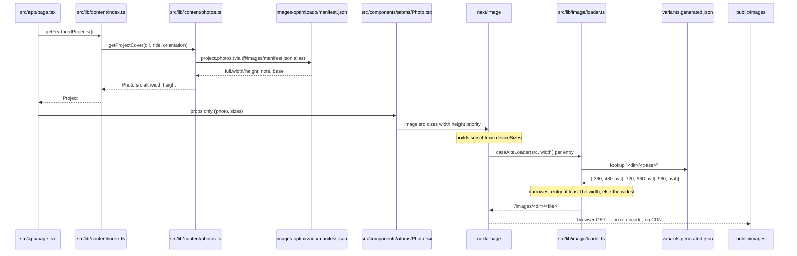

# Design: casa-alta-web-foundation

**Change:** `casa-alta-web-foundation` · **Phase:** sdd-design · **Date:** 2026-09-16
**Artifact store:** openspec · **Repo:** `/Users/hendrick/Documents/arquitectura-casa-alta-web`
**Inputs:** `proposal.md`, `exploration.md`, `openspec/config.yaml` (`rules.design`), `CLAUDE.md`

**Retrospective framing.** The architecture in §2 already exists on disk and builds green
(`npx tsc --noEmit`, `npm run lint`, `npx next build`, `npm run check:images`). This design
documents it so a future engineer can tell a **measured** decision from an aesthetic one.
Several of these decisions were reached after a cheaper alternative failed and was paid for.
**A decision recorded here without its evidence is a decision the next person will undo**, so
every decision below carries the alternative that lost and the measurement that killed it.

## 0. Decisions at a glance

| # | Decision | Reverting it costs | Evidence lives in |
|---|---|---|---|
| D1 | Custom `next/image` loader, not Netlify Image CDN | WebP substitution; corpus grows to 100–102% of original | `next.config.ts:5-11`, `src/lib/image/loader.ts:4-19` |
| D2 | `deviceSizes: [480, 960, 1600, 2000]` | 480 tier unreachable; a phone downloads the 960 file | `next.config.ts:13-17,35` |
| D3 | Accept srcset descriptor drift; fix belongs in the pipeline | Either silent 404s or a broken loader contract | `next.config.ts:19-34` |
| D4 | `variants.generated.json` + `check:images` gate | Silent 404s on 22 photos and 2 covers | `tools/sync-images.mjs:67-92`, `tools/check-image-urls.mjs:5-13` |
| D5 | Content seam: one reader, props-only components | Payload migration touches 31 components instead of 1 file | `src/lib/content/index.ts:24-35` |
| D6 | Hero: photograph full bleed, type on clean ground below | Re-opens two failed, measured typographic attempts | `src/components/organisms/Hero.tsx:15-41` |
| D7 | Atomic layering; `src/content` authored vs `src/lib/content` derived | Editorial data leaks into presentational components | `src/types/content.ts:1-11` |
| D8 | Three-tier image ownership; `images/` read-only; renumbering forbidden | Published URLs break; search ranking is discarded | `CLAUDE.md`, `.claude/hooks/git-guard.sh` |

Two items the proposal flags are **already resolved** — see §10.1 and §10.2.

## 1. Technical Approach

The site is a Next.js 16 App Router application (`next 16.3.5`, React 19.2.8, TypeScript 5
strict, Tailwind v4 CSS-first in `src/app/globals.css`) whose distinguishing property is that
**it does not optimize images at request time**. Bytes are encoded once, locally, by
`tools/`; the site's job is to name the right file and to stay legible to a search engine.

Three layers, each with one owner:

| Layer | Owner | Contract |
|---|---|---|
| Presentation — `src/components/**` (31 files) | hand-authored | receives props only; never imports content |
| Content seam — `src/lib/content/**` | hand-authored | the sole reader; joins editorial copy with the pipeline's manifest |
| Image delivery — `src/lib/image/**` + `tools/sync-images.mjs` | generated + 40-line loader | maps a requested width to a file that already exists |

Forward scope (per the proposal) adds routes, SEO artifacts, deploy config and a pipeline
normalisation. **None of it changes this shape**: it adds consumers of the seam and of the
variant table, never a second reader or a second encoder.

## 2. Architecture Decisions

### D1 — Custom `next/image` loader over Netlify Image CDN

**Choice.** `loader: "custom"` with `loaderFile: "./src/lib/image/loader.ts"`
(`next.config.ts:10-11`). The loader is 42 lines and does one thing: turn a requested width
into the filename of an AVIF the pipeline already wrote.

**Alternatives rejected.**

| Alternative | Why rejected |
|---|---|
| Next's default optimizer on Netlify (zero-config) | Routes through Netlify Image CDN, whose content negotiation prefers WebP over AVIF. WebP q82 measures **100–102% of the original** on this corpus — the default would erase the pipeline's main win and pay a per-request transform cost to do it |
| `unoptimized: true` | Serves the full-size 2000px AVIF to a phone; the pipeline's variants and the whole `srcset` become dead weight |
| A self-hosted optimizer (`sharp` in a route handler) | Re-encodes at request time what the pipeline already encoded better; doubles the encode surface and adds a runtime dependency |

**Evidence.** `CLAUDE.md` "Measured facts": WebP q82 vs original = 100–102%; WebP q78 ≈ 90%
(marginal); AVIF q62 = 26% on camera originals, ~75% on WhatsApp-degraded. Recorded in both
`next.config.ts:5-9` and the loader's own header (`loader.ts:4-19`). The rejected alternative's
cost is not an estimate: it is the reason `convert.sh` uses `cp` rather than `magick` for the
`.jpg` fallback.

**Non-negotiable.** `rules.design` forbids reintroducing Netlify Image CDN. The JPEG fallback
is never re-encoded.

### D2 — `deviceSizes: [480, 960, 1600, 2000]`

**Choice.** Override Next's default scale (`next.config.ts:35`), with `imageSizes: [240, 384]`
(`:38`) existing only to keep the scale valid and ordered below `deviceSizes`.

**Alternatives rejected.**

| Alternative | Why rejected |
|---|---|
| Next's defaults (start at 640) | The 480 tier becomes unreachable: a 375px phone asks for 640, and because the loader rounds **up**, it receives the 960 file — **doubling what it downloads** |
| A denser scale (e.g. every 240px) | More `srcset` entries, more distinct files fetched by crawlers, no measured benefit: variants only exist at the tiers the pipeline encoded |
| Removing `imageSizes` | Next requires a valid ordered scale; every `Photo` passes an explicit `sizes` anyway, so the small sizes are structural, not used |

**Evidence.** `next.config.ts:16-17` records the measurement, not a reasoning step: *"with the
defaults, `/images/02-el-bicho/01-...` at 640w resolved to the -960 AVIF."* Independent
support in `CLAUDE.md`: a 20-photo gallery drops from 3.4 MB to ~460 KB on mobile with correct
`srcset` + `sizes`.

**Honest gap.** Only the **winner's** score survives: mean delivered/requested ratio **0.927**,
the lowest of the candidate sets measured across the corpus (`next.config.ts:30-31`). The three
losing candidate sets were evaluated ad hoc and are recorded nowhere — `next.config.ts` is
untracked, so it has no history to recover them from. They are **UNVERIFIED and must not be
reconstructed**, exactly as `next.config.ts:31-32` instructs.

`CLAUDE.md` also records the *shape* that motivated the scale: *"47 photos are [480, 960, 1600],
another 47 are [360, 720, 1200]"*. Both reproduce exactly. Its trailing *"8 other signatures"*
does not: measured, the corpus has **25** distinct full-srcset signatures (see §10.3).

### D3 — The residual descriptor limitation, accepted and bounded

**Choice.** Accept that `next/image` labels each `srcset` entry with the width it **requested**,
not the width the loader returned. The fix is assigned to **the pipeline**, not to
`next.config.ts` or the loader. No code change here.

**Alternatives rejected.**

| Alternative | Why rejected |
|---|---|
| Have the loader return a URL carrying the real width, and post-process `srcSet` | The loader cannot relabel the descriptor — `srcSet` is assembled by `next/image` from `deviceSizes`. Reaching into it means reimplementing `next/image`'s srcset builder |
| Pin one variant per requested width (make tier ↔ width 1:1 in code) | Impossible by construction: the width depends on aspect ratio, so a 1200×1600 portrait's `-480` file is 360px. Any mapping is a table lookup, which D4 already is |
| Restrict `deviceSizes` to widths where label and file always agree | Would exclude 480 and 960 — the only two tiers a phone uses |

**Evidence — the drift runs in both directions, measured from this repo's own build**
(`next.config.ts:24-29`, `exploration.md` §3.10):

| Case | Emitted HTML | File on disk | Direction |
|---|---|---|---|
| Understated | `/images/10-obra-punta-zicatela/01-ventana-circular-sombra-follaje-960.avif 480w` | 720px (`loader.ts` rounded up from 480) | over-delivers bytes |
| Overstated | `/images/hero/vista-aerea-palapas-alberca-playa.avif 2000w` | 1600px (no wider file exists; widest-variant fallback) | over-delivers bytes |

**Why this is acceptable.** The loader never invents a width, so the failure mode is
over-delivery, never blur. Its cost is bounded and measured at 0.927 mean delivered/requested.
The alternative to the overstating case is a 404, which is strictly worse — that is the exact
failure `check-image-urls.mjs` was written to catch (§D4).

### D4 — `variants.generated.json` and the `check:images` gate

**Choice.** Variant **availability** is a generated table, not a computed path.
`tools/sync-images.mjs` writes `"<projectDir>/<base>" → [[width, filename], …]` ascending, and
the loader reads it. `tools/check-image-urls.mjs` is the post-build gate that proves every URL
the build emitted resolves on disk.

**Alternatives rejected.**

| Alternative | Why rejected |
|---|---|
| Compute the path: `-480.avif` for width ≤ 480, `-960.avif` above | **404s silently on 22 of 206 photos.** Measured from `variants.generated.json`: all 206 have a `-480`, but only **184 have a `-960`** — the other 22 have no second tier at all, and two of those 22 are project covers. Their tier set is a single `-480` file, so the table row is `[tier, full]` |
| Recompute tiers from the manifest's `tiers: [480, 960]` | `tiers` names the **LONG EDGE**; the `srcset` `w` is the **ACTUAL width**. A 1200×1600 portrait reports `360/720/1200` inside files named `-480`/`-960`. `src/types/manifest.ts:8-12` states the rule for anyone writing a consumer: *"Never assume `variants[i].width === tiers[i]`"* |
| Read `manifest.json` at runtime in the loader | The manifest is 248 KB; the table is 56 KB and is exactly the projection the loader needs. It is also the merge point for the hero, which is not in the manifest at all |

**Evidence.** The irregularity is deliberate, not a defect: `tools/variants.sh:24` sets
`MIN_GAIN=1.1` and `:51` skips a tier unless `sourceLongEdge > width * 1.1`. A source whose
long edge is ≤ 1056px legitimately has no `-960`, because emitting one would upscale or
produce a near-duplicate the browser never picks. Measured trap cases, named in the gate itself
(`tools/check-image-urls.mjs:71-76`):

```
/images/07-casa-tarrastro/01-fachada-piedra-pergola-jardin-960.avif   (variants: [480] only)
/images/09-casa-santa-rosa/01-pergola-madera-terraza-piso-960.avif    (variants: [360] only)
```

The gate exists because the failure is invisible: *"Any code that derives a variant path from
the requested width instead of reading availability will 404, and it will do so silently — the
page still renders, just with broken images"* (`check-image-urls.mjs:5-11`). It walks the built
HTML, extracts every `/images/…` reference from `src`, `srcset` and CSS `url()` alike, and exits
non-zero on a miss or on a trap hit. Measured: **21 distinct URLs across 5 built HTML files,
every one resolves.**

**Consequence for any future change.** The table's key is derived from the `src` the component
passes (`loader.ts:28-32`), and the gate's pattern is `/\/images\/[…]+\.(?:avif|jpg|png|webp)/g`
(`check-image-urls.mjs:58`). Changing the public image prefix means changing the loader's
`PREFIX` (`loader.ts:22`), the mirror target (`sync-images.mjs:28`) and the gate's pattern
together — see §10.4.

### D5 — The content seam

**Choice.** `src/lib/content/index.ts` is the **only** module in the application that reads
content. It exports 9 accessors; pages call them, components receive props.

**Alternatives rejected.**

| Alternative | Why rejected |
|---|---|
| Components import `src/content/*` directly | Every component becomes a content reader; a CMS swap touches 31 files and their tests |
| A React context / provider at the root | Moves the read into the client boundary; content is static at build time and belongs on the server |
| Fetch from a CMS API in each page | Same coupling as the first option, plus a network dependency at render |

**Evidence.** Verified on disk: `@/content/*` is imported by **exactly one file** —
`src/lib/content/index.ts:1-7`. The seam has exactly **two consumers**, both routed through
`@/lib/content`: `src/app/page.tsx:8` (the landing's five accessors) and
`src/app/layout.tsx:3,28` (`getSiteConfig()` at module scope for `metadata`). The seam's own
header states the contract (`index.ts:24-35`). Two supporting
rules make it hold: components type against `@/types/content` (`src/types/content.ts:1-11`),
and `src/lib/content/photos.ts` is the only place that knows a photo's on-disk identity maps to
a web path (`photos.ts:22-24`).

The seam also carries **policy**, not just plumbing, so policy cannot leak into components:
`getProjectPhotos()` filters `score >= 3` (`photos.ts:57`, implementing `CLAUDE.md`'s *"never
publish the 1/5 and 2/5 photos"*), and `getProjectCover(dir, title, orientation)` prefers a
landscape source for full-width slots because four of six featured covers are portrait
(`photos.ts:72-89`). `buildProject()` requires editorial data **and** a manifest entry **and** a
cover, returning `null` otherwise (`index.ts:57-74`), so a half-configured project renders
nothing rather than an empty card.

### D6 — Hero composition

**Choice.** The photograph renders full bleed in a 48svh box; the type sits on the page's clean
ground below it (`src/components/organisms/Hero.tsx:42-93`). Headline size is fluid —
`clamp(1.5rem, 7vw, 4rem)`.

**Alternatives rejected — both were built, then measured, then discarded.**

| Alternative | Measurement that killed it |
|---|---|
| White type over the photograph | The text region samples at **0.74–0.77 mean luminance** → **1.31:1** against white. Reaching even the **3:1** large-text floor needs a **60–77% dark scrim across the whole block** — a dark hero, which the brief rules out |
| Dark type over the photograph | Mean luminance said **13.8:1** and it looked like the answer, but mean is the wrong metric on a busy photograph: palapa roofs, dark glazing and palm trunks sit behind individual glyphs, and the **rendered result was less legible than the white version it replaced**. *Variance, not average, is what breaks type* |

**Evidence and the size decision.** `Hero.tsx:15-41` is the primary source; `exploration.md`
§4.2 mirrors it. With this type scale the headline block occupies ~**55% of the hero height**,
so no partial scrim can cover it without obscuring the photograph anyway — the composition had
to change, not the scrim. Size is fluid rather than stepped because the headline is a word
stack and a word cannot wrap: measured against the shipped Montserrat 600, *"y construcción"*
sets **9.325em** wide; 7vw caps at 4rem, keeping the three-line stack above the fold on a
1440×900 viewport next to a 48svh photograph.

**Reverting this re-opens two failed attempts.** Do not set the type on the photograph without
re-measuring contrast over the text region on this specific image.

### D7 — Atomic design layering, and the `src/content` / `src/lib/content` boundary

**Choice.** Four component layers with a strictly downward dependency
(`atoms` → `molecules` → `organisms` → `templates`, with `app/` above them), and **two content
directories with different jobs**:

| Path | Role | Nature |
|---|---|---|
| `src/content/*.ts` (7 files) | what an editor **authors** — Spanish copy, titles, categories, contact lines | hand-written; the only home of narrative data in the repo |
| `src/lib/content/*.ts` (2 files) | the **reader** that joins editorial copy with the pipeline's manifest and returns view models | hand-written; the seam |
| `src/types/content.ts` | the interface both sides type against | the contract |

**Alternatives rejected.**

| Alternative | Why rejected |
|---|---|
| One flat `src/content/` holding both copy and readers | Editor-facing data and pipeline joins would age together; the Payload swap would touch authored files |
| Put the readers in `src/lib/` only and drop `src/content/` | Loses the `*Content` vs plain-name convention that lets the authored and rendered shapes diverge without touching components (`src/types/content.ts:8-11`) |
| Merge `photos.ts` into `index.ts` | The photo bridge has its own input (the manifest) and its own policy (score filter, cover orientation); `exploration.md` §2.3 records that it **stays** through the CMS migration precisely because it does not read editorial content |

**Evidence.** 9 atoms / 9 molecules / 12 organisms / 1 template = 31 files, counted on disk.
`Section` carries the in-page anchor `id`; `Button` is documented as *"the only place a filled
brand-blue surface appears"*; `Photo` is documented as *"the only component that renders an
image"* (`src/components/atoms/Photo.tsx:18-24`). The layering is a real constraint, not
decoration — the single image component is what makes D4's contract enforceable at all.

**Where D5 lands physically.** A Payload migration is a change to `src/lib/content/index.ts`
plus its consumers' `await`, and to nothing else. See §8.

### D8 — Repository-safety architecture

**Choice.** Three image trees with different ownership, plus two prohibited operations
enforced at the git boundary.

| Tree | Owner | Mutability | Weight (measured 2026-09-16) |
|---|---|---|---|
| `images/` | the client's camera and WhatsApp | **append-only** — never modified, never renamed | 215 files / 74 MB |
| `images-optimizado/` | `tools/` | derived; safe to delete and regenerate; committed **once**, deliberately | 808 files / 125 MB |
| `public/images` | `tools/sync-images.mjs` | **ephemeral**, gitignored, rebuilt on every `predev`/`prebuild` | 599 files / 56.1 MB |

**Alternatives rejected.**

| Alternative | Why rejected |
|---|---|
| Serve `images-optimizado/` directly with a symlink or a custom static route | Next serves only `public/`. A mirror keeps the served surface conventional and lets the committed tree stay at the root, where the pipeline owns it (`sync-images.mjs:6-10`) |
| Mirror the whole 125 MB tree | The `.jpg` fallbacks are the untouched originals; the loader never asks for them. Mirroring AVIF only halves the payload |
| Commit `public/images` | Would double-commit ~56 MB of derived bytes and let the mirror drift from its source; `.gitignore` records the reason |
| Rename files to get clean URLs | A numeric prefix is in a **published URL**. Renaming breaks the link and discards accumulated search ranking. Reordering is the `order` field in `manifest.json` |

**Enforcement** — `.claude/hooks/git-guard.sh` runs `PreToolUse` on `Bash(git *)` and is not
advisory:

| Guard | Line | Behaviour |
|---|---|---|
| AI attribution in the commit | `:59` | **denies** |
| Staged rename that changes a numeric prefix | `:79-94` | **denies** (compares the two prefixes of the old and new path) |
| Staged modification/deletion of a file already tracked under `images/` | `:99-104` | **denies** (additions are allowed) |
| >50 staged files under `images-optimizado/`, or ≥20 MB of new content | `:107-120` | **warns** — the signal that a `git add -A` happened after a pipeline run |

**What the hook cannot do, stated plainly.** It inspects the **staged** set at commit time. It
cannot stop an unstaged write to `images/`, and it cannot stop a careless `rm` before staging —
it only catches it once staged for commit. It is a last line, not a sandbox; the binding rule
lives in `CLAUDE.md`.

**Why the hook is the right layer anyway.** `format.sh` (`PostToolUse` on `Write|Edit`)
deliberately skips `.json` and `.md`, so the generated `manifest.json` is never churned against
the pipeline that owns it — the same principle as D8's ownership table: **generated output is
regenerated, never hand-edited** (`openspec/config.yaml` → `rules.apply`).

## 3. Data Flow

### 3.1 Request path — component to served file



The bytes served are the bytes the pipeline wrote. Nothing between `Static` and the pipeline
changes them.

### 3.2 Build and deploy path — through `tools/sync-images.mjs`

```mermaid
sequenceDiagram
    participant Op as pnpm build, CI or local
    participant PB as prebuild hook
    participant Sync as tools/sync-images.mjs
    participant Opt as images-optimizado (committed)
    participant Pub as public/images (gitignored)
    participant Table as variants.generated.json
    participant Next as next build
    participant Gate as tools/check-image-urls.mjs

    Op->>PB: package.json script
    PB->>Sync: node tools/sync-images.mjs
    Sync->>Opt: walk *.avif (599 files)
    Sync->>Pub: copy when size or mtime differs (idempotent)
    Sync->>Opt: read manifest.json srcset
    Sync->>Sync: parse "<file> <w>" pairs into width, filename
    Sync->>Table: write ascending table (plus hero.json sidecar merge)
    Note over Sync,Table: deterministic — sha256 unchanged after a rebuild
    PB-->>Op: exit 0
    Op->>Next: next build
    Next-->>Op: .next with static HTML
    Op->>Gate: npm run check:images
    Gate->>Next: walk built HTML for /images/ URLs
    Gate->>Pub: assert each resolves, and the two known traps are absent
    Note over Gate: non-zero exit fails the pipeline
```

Two consequences worth stating because they are not obvious:

1. **`public/images` is gitignored, so the deploy build MUST run `sync-images.mjs`.** A build
   that skips `prebuild` deploys a site whose images 404 — the same silent failure D4 guards
   against. `netlify.toml` therefore MUST resolve to a command that runs the `prebuild` script
   (`pnpm build`), and `check:images` SHOULD gate the deploy immediately after the build.
2. **Only the two Node tools are needed to deploy.** `sync-images.mjs` and
   `check-image-urls.mjs` resolve their own root via `fileURLToPath(import.meta.url)`, so they
   run on any machine. The Perl/Bash pipeline stages are **machine-bound** (7 hardcoded
   `/Users/hendrick/...` paths across `parse.pl:13`, `convert.sh:17`, `variants.sh:15-16`,
   `champions.sh:9`, `build-sheets.sh:11`, `manifest.pl:9`) — and they never run in a deploy.
   Their output is committed. The machine-boundness is bounded to the authoring machine.

### 3.3 Pipeline regeneration path — where D3's fix lands

```mermaid
sequenceDiagram
    participant Sheets as tools/build-sheets.sh
    participant Agent as ranking agent (human-reviewed)
    participant Plan as parse.pl then buildplan.pl
    participant Convert as tools/convert.sh
    participant Variants as tools/variants.sh
    participant Man as tools/manifest.pl
    participant Opt as images-optimizado

    Sheets->>Agent: labeled contact sheets
    Agent->>Plan: "<proj>|<idx>|<slug>|<score>|<note>" rows
    Plan->>Convert: plan.txt (a destructive rm -rf OUT precedes conversion)
    Convert->>Opt: full AVIF q62 capped 2000 + byte-copied .jpg fallback
    Convert->>Variants: plan.txt + manifest.txt
    Variants->>Opt: -480 / -960 variants from the ORIGINAL source
    Note over Variants: MIN_GAIN 1.1 skip rule sets per-photo availability
    Variants->>Man: variants.tsv
    Man->>Opt: manifest.json (srcset is the authority)
    Opt-->>Opt: sync-images.mjs mirrors + rewrites the table
```

The normalisation called for in §10.5 changes **this** path — `variants.sh` and the manifest's
`srcset` — and then `sync-images.mjs` propagates it. It changes no site file.

## 4. File Changes

### 4.1 Already on disk — documented, not proposed

| File | Action | Role |
|---|---|---|
| `next.config.ts` | Unchanged | loader wiring, `deviceSizes`, and the measurements recorded as comments |
| `src/lib/image/loader.ts` | Unchanged | the loader contract (§5.1) |
| `src/lib/image/variants.generated.json` | Generated | 207 keys = 206 photos + 1 hero; rewritten on every `predev`/`prebuild` |
| `src/lib/content/index.ts`, `photos.ts` | Unchanged | the seam (§D5) |
| `src/components/**` (31) | Unchanged | props only |
| `tools/sync-images.mjs`, `check-image-urls.mjs`, `hero.sh` | Unchanged | location-independent tools |
| `.claude/hooks/git-guard.sh`, `format.sh` | Unchanged | enforcement (§D8) |

### 4.2 Forward scope — files this change will touch

| File | Action | What changes |
|---|---|---|
| `netlify.toml` | Create | build command (`pnpm build`, so `prebuild` runs), publish dir, Node version, `@netlify/plugin-nextjs` |
| `src/app/sitemap.ts` | Create | `image:image` entries from the manifest |
| `src/app/robots.ts` | Create | crawl policy + sitemap reference |
| `src/app/opengraph-image.tsx` | Create | social card |
| `src/app/proyectos/[slug]/page.tsx` | Create | detail route, reads the seam |
| `src/app/{servicios,proceso,nosotros,contacto}/page.tsx` | Create | static routes from the seam |
| `src/content/site.ts` | Modify | nav moves from `/#anchor` to routes (`:17-28`); Facebook/TikTok hrefs when supplied (`:54-56`) |
| `src/components/organisms/ProjectsGrid.tsx` | Modify | pass `href` to each `ProjectCard` (`:56-70`) |
| `src/lib/image/loader.ts` + `next.config.ts` | Modify | **only** if clean public image URLs are adopted (§10.4) |
| `src/content/projects.ts` | Modify | client-confirmed year/location/story for 12 provisional entries |
| `tools/variants.sh` | Modify | width normalisation; regenerates `images-optimizado/` — the riskiest stage (§11) |
| `images/` | **Untouched** | read-only |

`ProjectCard` needs no change to gain links: its optional `href` already exists, and the hover
affordances are conditionally applied only when it is passed
(`src/components/molecules/ProjectCard.tsx:16-21,74-82`).

## 5. Interfaces and Contracts

### 5.1 Loader contract (`src/lib/image/loader.ts`)

```
casaAltaLoader({ src, width }) -> string
```

1. Strip `/images/`; split into `dir` + `base` (drop `.avif`) — `:28-32`.
2. Look up `"<dir>/<base>"` in `variants.generated.json`.
3. **Unknown src returns the input untouched** — never an invented path (`:35`).
4. Otherwise the **narrowest variant ≥ width**, or the **widest** if none covers it (`:38-39`).

Rule 4 is what makes the two `-960`-less covers safe today: a 960 request on
`09-casa-santa-rosa`'s cover falls back to its widest file instead of 404ing.

### 5.2 Sizes contract (`src/components/atoms/Photo.tsx`)

`sizes` is **required**, not optional: the loader is driven by it. `Photo.tsx:7-11` states the
stakes — *"A wrong `sizes` means a wrong file."* Three call sites pass one explicitly:
`Hero` (`100vw`), `ProjectsGrid` featured (`100vw`), `ProjectsGrid` grid cells
(`(min-width: 768px) 50vw, 100vw`).

### 5.3 Content-manifest alias

`tsconfig.json:22-23` maps `@/*` → `./src/*` and `@images/*` → `./images-optimizado/*`, so
`src/lib/content/photos.ts:1` imports the pipeline's own output with **no copy step**. The
manifest is the only shared contract between the pipeline and the site; `src/types/manifest.ts`
mirrors it by hand because it is generated by `tools/manifest.pl`.

### 5.4 Variant table schema

```
{ "<projectDir>/<base>": [[width: number, filename: string], ...] }   // ascending by width
```

Ascending order is load-bearing — the loader takes the first entry that covers the request.
`tools/hero.sh:38` records it for its own sidecar: *"Ascending by width, full size last: the
loader relies on the order."*

## 6. Verification Strategy

**There is no test runner, by policy.** `openspec/config.yaml` records `strict_tdd: false` and
forbids inventing one as a side effect of another change. The gates are the verification
substitute, and the image contract gets the strongest one:

| Layer | What it proves | Gate |
|---|---|---|
| Types | the seam's return types and every component prop | `npx tsc --noEmit` |
| Lint | hook rules, `next/core-web-vitals` + `next/typescript` | `npm run lint` |
| Build | routes render; `prebuild` regenerates the mirror and table | `npx next build` |
| **Image contract (integration)** | every image URL the build emitted resolves on disk; the two known traps are never requested | `npm run check:images` — post-build, needs `.next` |
| Determinism | the generated table is byte-stable across builds | `sha256 variants.generated.json` before/after a build |

`check:images` is the closest thing this repo has to an integration test, and it exists because
the failure it catches is silent (§D4). **Any change touching the loader, `deviceSizes`, the
variant table or the image URL prefix MUST re-run it.** The hero contrast figures in §D6 are
hand measurements and have **no** automated gate; treat them as evidence, not as a test.

## 7. Threat Matrix

`references/threat-matrix.md` applies only to designs that change routing, shell commands,
subprocesses, VCS/PR automation, executable-file classification, or process integration. This
design is a **retrospective document of an existing application and its image pipeline**; the
forward scope adds Next.js HTTP routes and generated assets.

| Boundary | Applicability | Reason |
|---|---|---|
| Documentation-like paths | **N/A** | No path is classified as executable or non-executable by this change. `format.sh`'s extension list already exists and is unchanged |
| Git repository selection | **N/A** | No git command, `-C`, or cwd authority is designed or changed here |
| Commit state | **N/A** | `git-guard.sh` reads the staged set but is existing, unchanged code. Staging policy is stated in §D8, not automated by this change |
| Push state | **N/A** | No push automation exists or is designed |
| PR commands | **N/A** | No PR automation exists or is designed |

The near-miss worth naming: the clean-image-URL work (§10.4) is **application** routing — a URL
map emitted from `src/` — not command or subprocess routing, so it does not open this matrix.
Likewise `tools/variants.sh` is a data transform over files, not a command dispatcher.

**No RED tests are planned, and none may be invented**: `openspec/config.yaml` → `strict_tdd:
false`. The mapped verification for every applicable case above is the gate table in §6.

## 8. Migration and Rollout

Staged, and each stage is independently revertible (proposal → Rollback Plan). Rollout order is
driven by what unblocks the most: deploy config → SEO layer → routing → client-dependent content
→ Payload last.

### The Payload CMS stage (deferred, but designed here)

| File | Change |
|---|---|
| `src/lib/content/index.ts` | **the only file that must change** — 9 accessors become async reads; return types stay identical |
| `src/app/page.tsx` | becomes `async` and `await`s the accessors |
| `src/app/layout.tsx` | `getSiteConfig()` at module scope (`:28`) becomes `generateMetadata()` |
| `src/content/*.ts` (7 files) | become seed data or are deleted |
| `src/lib/content/photos.ts` | **stays** — it reads the image manifest, not editorial content |
| `src/types/content.ts` | **stays** — the return types are the contract |
| **All 31 components** | **untouched** |

That last row is the whole point of D5. If a Payload migration ever requires editing a
component, the seam has been broken somewhere upstream and the fix belongs in the seam.

**No data migration** is required by this change: no schema, no persisted user data, no feature
flags. Rollback is per stage, and the only destructive stage is the `variants.sh` normalisation.

## 9. Architectural Invariants

Stated as MUST NOT, so a future reviewer can reject a diff quickly. Each traces to a decision
above and to `openspec/config.yaml` → `rules.design`.

1. MUST NOT reintroduce Netlify Image CDN, or any request-time re-encoder (D1).
2. MUST NOT re-encode the `.jpg` fallback (D1).
3. MUST NOT change the `deviceSizes` tiers to a scale that excludes 480 (D2).
4. MUST NOT make the loader compute a variant path instead of reading availability (D4), and
   MUST NOT remove `check:images` from the pipeline.
5. MUST NOT let a component import `@/content/*` or call a content accessor (D5).
6. MUST NOT rename a path that changes a project or photo numeric prefix; reordering is the
   `manifest.json` `order` field (D8).
7. MUST NOT write, rename or delete a file under `images/`, including in git (D8).
8. MUST NOT hand-edit `images-optimizado/` or `variants.generated.json`; regenerate through
   `tools/` (D8).
9. MUST NOT stage generations of the image tree with `git add -A` (D8), and MUST NOT add AI
   attribution to a commit.
10. MUST NOT treat tiering by long edge as a site bug. It is a bounded pipeline limitation whose
    fix belongs in the pipeline (D3).

## 10. Open Questions and Corrections

### 10.1 RESOLVED — the lockfile conflict

The proposal's Open Inconsistency #1 (two untracked, un-ignored lockfiles) is **closed**.
`package-lock.json` was deleted and is now gitignored with its reason recorded in `.gitignore`
(`:10-13`, *"npm lockfile deliberately not used: pnpm owns the tree"*); the file is absent from
disk. pnpm owns the tree (`node_modules/.pnpm/`, `pnpm-workspace.yaml`).

**Follow-on action, not yet taken:** `pnpm-lock.yaml` (137,690 B) is **still untracked**. A
reproducible Netlify build needs it committed — pnpm resolves from the lockfile. Committing it
is a staging decision under ordinary repository policy, not a design decision.

### 10.2 CORRECTED — the `next.config.ts` figures

The proposal quotes the exploration as reporting *"8 other signatures"*. That figure does **not
reproduce** and the file on disk is right: `next.config.ts:21` says **25 distinct full-srcset
signatures**, which is the measured value. The comment also correctly documents drift in **both**
directions with the two measured examples (`:24-29`), matching the build output. Treat 25 as
authoritative.

### 10.3 Preserved as UNVERIFIED

- The **three losing `deviceSizes` candidate sets and their scores**. Only the winner (**0.927**
  mean delivered/requested) is recorded, in `next.config.ts:30-31`; the file is untracked, so
  there is no history. **Do not reconstruct them** (`next.config.ts:31-32`).
- The **22 photos with a single tier** are verified (184 of 206 have a `-960`); *which* 20
  non-cover photos those are beyond the two named covers is not enumerated anywhere and does
  not need to be — the loader reads availability, it never lists.

### 10.4 Open — the clean public image URL mechanism

`CLAUDE.md` requires the numeric prefix out of public URLs. This is a **routing** change and
must never be a filesystem rename. Two candidate mechanisms, with the coupling each forces:

| Mechanism | Cost |
|---|---|
| A rewrite map generated at config load from the manifest (`next.config.ts` rewrites), with the loader emitting the clean prefix | Couples `next.config.ts` to the manifest at config-build time; still requires updating `loader.ts:22` `PREFIX`, `sync-images.mjs:28` target, and `check-image-urls.mjs:58` pattern together |
| A clean-slug map in `src/lib/image/` consumed by `photos.ts:22-24`, with `public/` laid out under the clean path | Moves the mirror's directory shape; largest blast radius on the committed tree |

Recommendation for the routing stage: the rewrite map, because it changes **no** committed file
under `images-optimizado/`. Not decided here — the proposal lists it as remaining scope, and the
choice belongs to that stage's design.

### 10.5 Open — the pipeline's bounded limitations

- **Variant widths are tiered by long edge** (D3). The fix is `variants.sh` normalisation, and it
  is the only stage in this change that rewrites `images-optimizado/`. Regenerate via the full
  six-step pipeline, back up the tree first, and stage deliberately.
- **`convert.sh:37` begins with `rm -rf "$OUT"`** and consumes `/tmp/casa-alta-work/plan.txt`,
  which is not durable. A bare single-script re-run fails; the rebuild path is the whole
  pipeline. `exploration.md` §6.10.
- **7 hardcoded absolute paths across 6 files** keep the pipeline on this machine. It does not
  block deploys (§3.2), only another machine.

### 10.6 Measured correction — the mirrored AVIF set is 56.1 MB, not ~34 MB

The comment in `tools/sync-images.mjs:8` (and `exploration.md` §3.7) says the mirror is *"~34
MB"*. Measured on the committed tree on 2026-09-16:

| Group | Files | Bytes |
|---|---|---|
| Primary AVIF (incl. the hero) | 207 | 34.3 MB |
| `-480` variants | 207 | 5.4 MB |
| `-960` variants | 185 | 16.4 MB |
| **Mirrored AVIF total** | **599** | **56.1 MB** |
| JPEG fallbacks (not mirrored) | 206 | 63.6 MB |
| `images-optimizado/` total | 808 | 125 MB |

The 34.3 MB figure matches `CLAUDE.md`'s *"63.6 MB → 34.0 MB AVIF"* almost exactly, and 63.6 MB
matches the fallback total exactly. The reading that fits both measurements: **the 34.0 MB
figure counted primary AVIFs only, not the variants.** That reading is an inference from the
decomposition, not a recorded statement — marked here as such. **The decision is unaffected**
(mirror AVIF only: 56.1 MB instead of 125 MB), but the deploy-time payload is 56 MB, not 34 MB,
and a future engineer sizing a deploy or a cache budget should use the measured number.

### 10.7 Open — other repository drift

- `CLAUDE.md` is stale in four places (`exploration.md` §8.7): it opens with *"There is no
  application code yet"*, says *"the site app does not exist yet"*, omits `src/`, `public/`,
  `openspec/` and `next.config.ts` from its layout, and its binary counts have drifted
  (`images/` 215 files / 74 MB; `images-optimizado/` 808 files / 125 MB).
- `src/content/projects.ts:15-21` describes *"two entries confirmed"* while the exploration
  measured one complete narrative plus one with a location only, and **zero `year` values across
  all 14 projects**. Client-facing work, not engineering work.
- `public/brand/logo-casa-alta.png` (354×160) cannot be regenerated from the repository's own
  sources: no file in `tools/` produces it, and its aspect matches neither brand source. It came
  from outside the repo.
- No `opengraph-image`, no `sitemap.ts`, no `robots.ts`, no `netlify.toml` exist today.

## 11. Risks

| Risk | Likelihood | Architectural mitigation |
|---|---|---|
| A future change "simplifies" the loader into computing paths | Med | `check:images` fails the build; §9 invariants; `loader.ts:35` comment |
| Deploy skips `prebuild`, images 404 silently | Med | `netlify.toml` must use `pnpm build`; gate the deploy on `check:images` (§3.2) |
| Serving 56.1 MB of AVIF to a clean environment is slower than expected | Med | Measured, not estimated (§10.6). Cache the mirror; never mirror the JPEG fallbacks |
| `variants.sh` normalisation regenerates the tree and a careless stage commits ~800 binaries | Med | Back up first; stage deliberately; `git-guard.sh:107-120` warns |
| `convert.sh` destroys `images-optimizado/` before a failed re-run | Med | Rebuild only via the full six-step pipeline |
| A client-facing field is filled with invented copy | Med | `src/content/projects.ts` policy: *"an empty field is a to-do, a guessed one is a lie that ships"* |
| Fabricated testimonials | Low | `testimonials.ts` stays `[]`; the type, the component and the slot wait |
| Payload migration leaks into components | Low | The seam holds today (verified: no component imports `@/content/*`) |
| No test runner means regressions surface at build | Med | Gates in §6; do not invent a runner |

## Key Learnings

1. The custom loader exists because Netlify Image CDN negotiates WebP before AVIF, and WebP q82
   measures 100–102% of the original on this corpus, so the default path would erase the
   pipeline's only real format win.
2. Next's default `deviceSizes` start at 640, which makes the 480 tier unreachable: a 375px
   phone asked for 640, the loader rounded up to the 960 file, and the download doubled.
3. `manifest.json`'s `tiers: [480, 960]` names the long edge while each srcset `w` descriptor
   names the actual pixel width, so 22 of 206 photos have no `-960` file at all and any code
   that computes a variant path instead of reading availability 404s silently.
4. Both hero typography attempts over the photograph were built and measured and both failed —
   white type measured 1.31:1 at 0.74–0.77 luminance, and dark type's 13.8:1 mean was defeated
   by variance behind individual glyphs — so the photograph stays full bleed and the type sits
   on clean ground below it.
5. The mirrored AVIF set is 56.1 MB across 599 files, not the ~34 MB its own comment claims;
   34.3 MB is the primary AVIFs alone, which is the figure CLAUDE.md's 63.6 MB → 34.0 MB
   measurement was counting.
